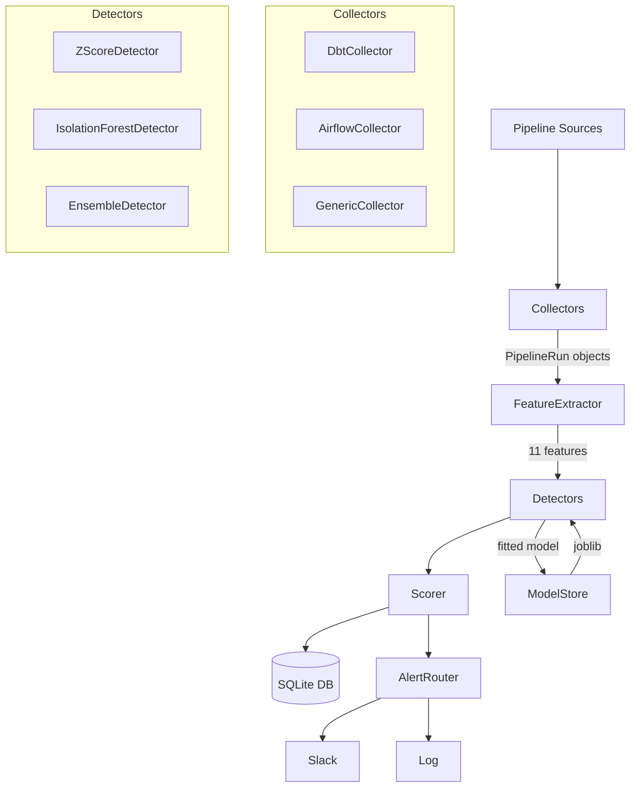

# Pipeline Anomaly Detector

[](https://github.com/your-org/pipeline-anomaly-detector/actions)
[](https://codecov.io/gh/your-org/pipeline-anomaly-detector)
[](https://pypi.org/project/pipeline-anomaly-detector/)
[](https://pypi.org/project/pipeline-anomaly-detector/)
[](LICENSE)

**Pipeline Anomaly Detector** is a production-ready ML toolkit for detecting anomalies in data pipeline runs. It collects run metadata from dbt, Airflow, or any custom source, extracts 11 statistical features per run, and scores each run with a choice of Z-Score, Isolation Forest, or Ensemble detectors, sending alerts to Slack when something looks wrong.

---

## Quickstart

```bash
# 1. Install
pip install pipeline-anomaly-detector

# 2. Collect runs from dbt
pad collect --source dbt --dbt-dir "./target/run_results.json" --since 2024-01-01 --output runs.jsonl

# 3. Train an ensemble detector
pad train --input runs.jsonl --detector ensemble --output ./models

# 4. Score new runs
pad score-batch --input new_runs.jsonl --model ./models/global_ensemble_*.joblib --db scores.db

# 5. Explain an anomaly
pad explain --run-id anomaly_duration_000 --model ./models/global_ensemble_*.joblib --db scores.db
```

---

## Architecture



---

## Detector Comparison

| Detector | Algorithm | Interpretability | Multi-variate | When to use |
|---|---|---|---|---|
| `zscore` | Rolling z-score | High (per-feature z) | No | Simple baselines, limited data |
| `isolation_forest` | sklearn IsolationForest | Medium (permutation importance) | Yes | Complex multi-feature anomalies |
| `ensemble` | Weighted average | Medium (union of features) | Yes | **Production default** |

See [docs/detector_comparison.md](docs/detector_comparison.md) for full details.

---

## Features

11 features are extracted per pipeline run:

| Feature | Description |
|---|---|
| `duration_seconds` | Raw wall-clock duration |
| `duration_z` | Z-score vs rolling 30-run window |
| `rows_processed_log1p` | log1p of row count |
| `row_count_delta_pct` | % change vs previous run |
| `null_rate_max` | Max null rate across columns |
| `null_rate_delta` | Change in null rate |
| `hour_of_day` | UTC hour (0–23) |
| `day_of_week` | 0=Monday … 6=Sunday |
| `is_weekend` | Binary weekend flag |
| `status_is_success` | Binary success flag |
| `rejection_rate` | rows_rejected / rows_processed |

See [docs/feature_reference.md](docs/feature_reference.md) for the full reference.

---

## Documentation

- [Quickstart](docs/quickstart.md)
- [Feature Reference](docs/feature_reference.md)
- [Detector Comparison](docs/detector_comparison.md)

---

## Development

```bash
# Clone and install in editable mode with dev extras
git clone https://github.com/your-org/pipeline-anomaly-detector.git
cd pipeline-anomaly-detector
pip install -e ".[dev]"

# Run tests
pytest tests/ -v --cov=pipeline_anomaly_detector

# Open the exploration notebook
jupyter notebook notebooks/exploration.ipynb
```

---

## License

MIT License; see [LICENSE](LICENSE).
